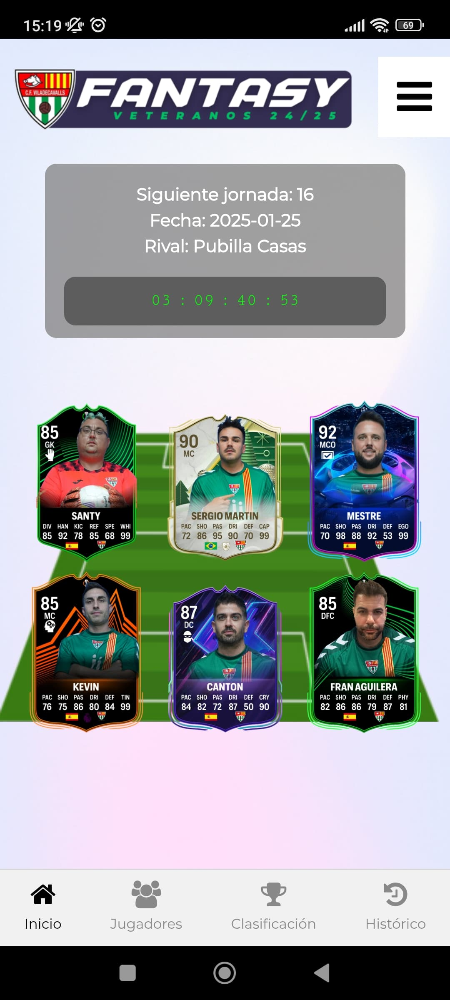
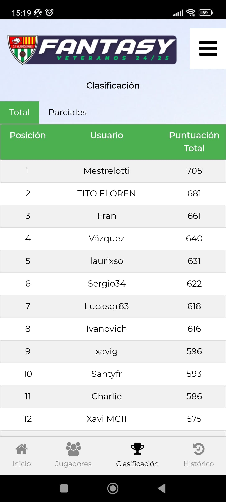
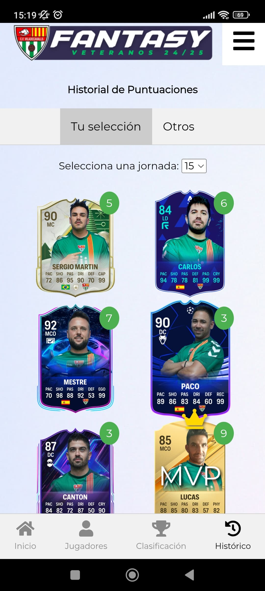
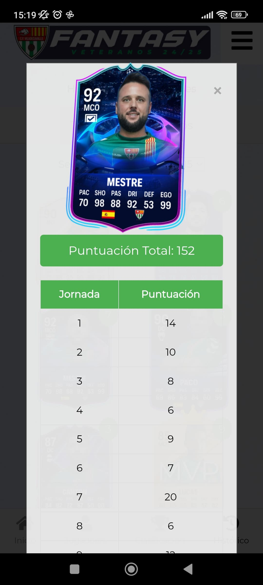

# This is Amateur Fantasy League
AFL: Amateur Fantasy League is an app for amateur teams and leagues. In them, they will be able to choose 6 players each day and add their scores to try to lead the classification. They will be able to follow the statistics of each player and the league.

This web application, developed in Python with the Flask Framework, HTML and CSS, has an administrator section to add matchdays, players and weekly scores.
Users can register using a code.
All of this is stored in a MySQL database.

# Getting started
